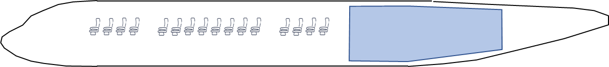
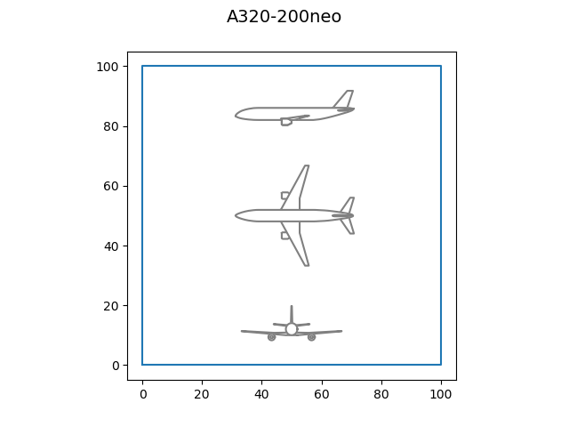

# Use case: an hydrogen powered turbofan

!!! note

    This study case is kindly provided
    by [Thierry Druot](https://cv.archives-ouvertes.fr/thierry-druot>),
    Pre-Project Research Engineer at [Airbus](https://www.airbus.com/>),
    seconded to [ENAC](https://www.enac.fr/en).
    The authors of this practice are very grateful to him.
    Thanks, Thierry!

Hydrogen is a candidate to replace kerosene for future airplanes
because it does not emit carbon dioxide when burning,
as described in the 
[The Airbus' ZEROe project](https://www.airbus.com/en/innovation/low-carbon-aviation/hydrogen/zeroe):

> Airbus’ ambition is to bring to market the world’s first hydrogen-powered commercial aircraft by 2035. 
> To get there, 
> our ZEROe project is exploring a variety of configurations and technologies, 
> as well as preparing the ecosystem that will produce and supply the hydrogen.

The aim of this study is to evaluate the impact of the use of liquid hydrogen
in place of kerosene on the design and performances of a turbofan airplane.


## The type of airplane targeted

The type of airplane in the focus of this study corresponds to an A320.

We suppose that we want to redesign an airplane
with the same set of requirements than the classical kerosene A320
but powered with liquid hydrogen.


### The problems with liquid hydrogen

Liquid hydrogen (LH2) has three main drawbacks
in comparison to kerosene as soon as airborne storage is needed :

1. The very low temperature of LH2 (~20Kelvin, -253°C) requires very specific fuel system
   to take it from the tank and feed the engine at ambient temperature.
2. The volume of the tank is about 4 time bigger than with kerosene
   for an equivalent amount of internal energy.
3. The weight of tank is important due the necessary high level of insulation.

Point 1 is out of the scope of this study,
but we will treat points 2 and 3
that are linked to the level of maturity of liquid hydrogen storing technology.

### The technological evolutions

The technological level of LH2 tanking system is classically characterized
by two indices :

- The gravimetric index $\frac{\text{LH2}_\text{mass}}{\text{LH2}_\text{mass}+\text{Tank}_\text{mass}}$
  quantifies the efficiency of the tank to store LH2 in terms of mass.
- The volumetric index $\frac{\text{LH2}_\text{volume}}{\text{LH2}_\text{volume}+\text{Tank}_\text{volume}}$
  quantifies the efficiency of the tank to store LH2 in terms of volume.

The technology is expected to evolve in the coming years,
following values are commonly accepted :

|                   | State of the art 2021 | Status 2030 |
|-------------------|-----------------------|-------------|
| Gravimetric index | 0.1                   | 0.3         |
| Volumetric index  | 0.606                 | 0.845       |

The simplest way to store a huge volume of LH2 in the aircraft is probably
to put the tank in the rear fuselage.
This implies to share the available length
inside the fuselage between passengers and LH2 tank.
Anyway,
acceptable performances cannot be achieved
without lengthening the fuselage of the kerosene airplane.



For several reasons,
fuselage length cannot be stretched beyond a certain limit.
In this study,
we will use a maximum value for the ratio (fuselage_length)/(fuselage_diameter)
to limit the length of the fuselage.
This maximum value will be taken from the A340-600
which is considered has an extreme regarding this ratio.

### Achieve the performances of the A320

The classical kerosene A320 has the following general characteristics and performances:

- Nominal seat capacity = 150 pax (passengers)
- Nominal range = 3000 NM (1 Nautical Mile = 1852 m)
- Cruise speed = Mach 0.78
- Maximum Take Off Weight (MTOW) = 77000 kg
- Maximum Landing Weight (MLW) = 65000 kg

- Engine maximum thrust = 120 kN (103 Newtons)
- Engine Bypass Ratio (BPR) = 9 (ratio of cold flow over hot flow for a turbofan)
- Wing area = 122 m²
- Wing aspect ratio = 9  (wing_span² / wing_area)

- Fuselage aspect ratio = 11.0  (fuselage_length / fuselage_height, maximum is 13.4)
- Maximum Take Off Field Length (TOFL) sea level, temperature ISA+15, MTOW = 2200 m
- Maximum Approach speed sea level, temperature ISA, MLW = 137 kt (1 knots = 1.852 km/h)
- Minimum Vertical speed Top Of Climb (TOC), 97% MTOW, cruise speed, ISA, Max Climb Rating (MCL) = 300 ft/min (1 m/s = 197 ft/min)
- Minimum Vertical speed Top Of Climb (TOC), 97% MTOW, cruise speed, ISA, Max Cruise Rating (MCR) = 0 ft/min (1 m/s = 197 ft/min)
- One engine inoperative minimum climb path, 97% MTOW, ISA, Maxi Continuous Rating (MCN) = 1.1%
- Maximum Time To Climb to cruise altitude, Maxi Climb Rating (MCL) = 25 min



Preliminary studies have shown
that a range of 3000 NM could not be achieved
with 150 passengers on board with hydrogen as fuel.
Number of passengers or range (or both) must be reduced.
After having discussed with Marketing team,
engineers have chosen to keep the passenger capacity and reduce the range to 1800 NM.

It is assumed that about ten years will be necessary to develop and certify
such a full liquid hydrogen powered aircraft
so **2030 technological level will be assumed**.
It is supposed that the use of hydrogen have no significant impact
on the engine characteristics and performances.

### Find the hydrogen powered A320-like aircraft

The problem is now to find the “best” hydrogen powered airplane design
that satisfies the same operational constraints as the kerosene A320
(except for the range).
The existing know how in terms of airplane design has shown
that the Maximum Take-Off Weight (MTOW) of the airplane is a good criterion
to optimize a design.

## The design problem

The design problem can be summarized as follows :

> Find the values of the **design parameters** 
> that minimize the **criterion MTOW**
> whilst satisfying **operational constraints**.

The **design parameters** are :

- the engine maximum thrust  (100 kN ≤ thrust ≤ 150 kN, default: 125 kN),
- the engine bypass ratio  (BPR)  (5 ≤ BPR ≤ 12, default: 8.5),
- the wing area  (120 m² ≤ area ≤ 200 m², default: 160 m²),
- the wing aspect ratio  (7 ≤ ar ≤ 12, default: 9.5).

The **operational constraints** are :

- the take off field length (TOFL ≤ 2200 m),
- the approach speed (VAPP ≤ 137 kt),
- the vertical speed MCL rating  (300 ft/min ≤ VZ_MCL),
- the vertical MCR rating  (0 ft/min ≤ VZ_MCR),
- the one engine inoperative climb path  (1.1% ≤ OEI_PATH),
- the time To climb to cruise altitude  (TTC ≤ 25 min),
- the fuselage aspect Ratio  (FAR ≤ 13.4).

In addition to this,
several **technological parameters** need to be taken into account:

1. the tank gravimetric index = 0.3,
   with uncertainty: Triangular(0.25, 0.3, 0.305),
2. the tank volumetric index = 0.845,
   with uncertainty: Triangular(0.8, 0.845, 085),
3. the aerodynamic efficiency factor = 1.,
   with uncertainty: Triangular(0.99, 1., 1.03),
4. the propulsion efficiency factor = 1.,
   with uncertainty: Triangular(0.99, 1., 1.03),
5. the structure efficiency factor = 1.,
   with uncertainty: Triangular(0.99, 1., 1.03),

where Triangular($a$, $b$, $c$) represents
the [triangular distribution](https://en.wikipedia.org/wiki/Triangular_distribution)
with lower limit $a$, mode $d$ and upper limit $c$:


These probability distributions are not symmetrical
as it is always easier to make something less efficient than expected...

!!! note

    The involved factors are defined
    so that a low value is better than a high one.

The points 3, 4 and 5 are related
to the three main technical areas involved in aircraft design,
namely aerodynamics, propulsion and structure.
These factors are representing the unknown
included in any creative activity.

## The numerical simulator

To solve this design problem,
a Python function is provided to compute the criterion MTOW
and the operational data from the design and technological parameters.

### The Python function

This function packages a dedicated Python script
which is an application of [MARILib](https://github.com/marilib/MARILib_obj>)
(Multidisciplinary Airplane Research Integrated Library)
developed at [ENAC](https://www.enac.fr/en>)
to support Airplane Conceptual Design Teaching and some research activities [^1].

[^1]: Thierry Druot, Mathieu Belleville, Pascal Roches, François Gallard, Nicolas Peteilh, et al. A Multidisciplinary Airplane Research Integrated Library With Applications To Partial Turboelectric Propulsion. *AIAA Aviation 2019 Forum*, Jun 2019, Dallas, United States. [⟨hal-02160977⟩](https://hal-enac.archives-ouvertes.fr/hal-02160977>)

The signature of the Python function is:

```python
   data = fct_turbofan_h2(techno, design, mode)
```

where `data`, `techno`, `design` and `mode`
are Python dictionaries defined below:

```python
   data = {
       "mtow": mtow, # (kg) Maximum Take Off Weight
       "fuel": fuel_block, # (kg) Specific mission fuel
       "coc":  cash_op_cost, # ($/trip) Specific mission Cash Operating Cost
       "tofl": tofl, # (m) Take Off Field Length
       "vapp": app_speed, # (m/s) Approach speed
       "vz_mcl": vz_mcl, # (m/s) Vertical speed in MCL rating
       "vz_mcr": vz_mcr, # (m/s) Vertical speed in MCR rating
       "oei_path": oei_path, # (rad) Air path with one engine inoperative
       "ttc": ttc, # (s) Time To Climb
       "far": far # () Fuselage aspect ratio
   }
```

!!! note

    `"fuel_block" and `"cash_operating_cost"` are outputs
    that can be used as criterion for the optimization.

```python
   techno = {
       "drag": 1.0, # Aerodynamic efficiency factor
       "sfc": 1.0, # Propulsion efficiency factor
       "mass": 1.0, # Structure efficiency factor
       "tvi": 0.845, # Tank volumetric index
       "tgi": 0.3, # Tank gravimetric index
   }

   design = {
       "thrust": unit.N_kN(121), # (N) Engine maximum thrust
       "bpr": 9, # () Engine Bypass Ratio
       "area": 164, # (m2) Wing area
       "aspect_ratio": 9 # () Wing aspect ratio
   }

   mode = "eval" # Configuration, Can be "eval", "draw", "plr", "ds".
```

The different values for mode have the following effects :

- `"eval"`: only data is provided as output
- `"draw"`: a small 3 view drawing of the airplane is displayed
- `"plr"`: a Payload vs Range diagram is displayed
- `"ds"`: a graphical analysis of the design space around the provided point is displayed

You can access the `turbofan_h2_function` with

```python
   from lh2pac.turbofan_h2_function import fct_turbofan_h2, str_h2turbofan

   output_data = fct_turbofan_h2(techno, design, "eval")
   str_h2turbofan(techno, design, output_data)
```

### Unit conversion

!!! warning

    The function only knows STANDARD UNITS which means
    that all data provided to the function MUST be expressed in standard units
    and that all data retrieved by the function are expressed in standard units.

Used standard units are:

| Standard unit    | Symbol | 
|------------------|--------|
| meter            | m      | 
| square meter     | m2     |
| kilogram         | kg     |
| second           | s      |
| meter per second | m/s    |
| nots             | kt     |
| Newton           | N      |
| Dollar           | $      |

Usual units are:

| Usual unit      | Symbol | 
|-----------------|--------|
| minute          | min    |
| feet            | ft     |
| feet per minute | ft/min |
| knot            | kt     |

One may use specific converters provided by MARILib in the module **unit**
to play between the units.

The syntax of the converters is: `[target_unit]_[initial_unit](value)`.

Required converters for the study are:

- `ftpmin_mps()`,
- `mps_ftpmin()`,
- `kt_mps()`,
- `mps_kt()`,
- `N_kN()`,
- `kN_N()`,
- `s_min()`,
- `min_s()`.

The function `print_data(data)` is provided
to display the content of the data dictionary rounded in usual units.


### Start with GEMSEO

The first stage of this project will be
to discover the GEMSEO examples available in the `utils` section
and the `H2TurboFan` class which is a so-called *discipline*
wrapping the function `fct_turbofan_h2`.

*discipline* is a key concept in GEMSEO.

Note that a discipline considers input and output data of the form `{name: value, ...}`
where `name` is the name of a variable and `value` is its value expressed as a 1D NumPy array.

This `H2TurboFan` class and the other GEMSEO-based helpers 
are in the package `lh2pac.gemseo` of the `src` directory`:

- the module `lh2pac.gemseo.discipline` includes the `H2TurboFan` discipline,
- the module `lh2pac.gemseo.utils` includes `draw_aircraft` and `get_aircraft_data`,
  two functions to get information about an aircraft or visualize it..
